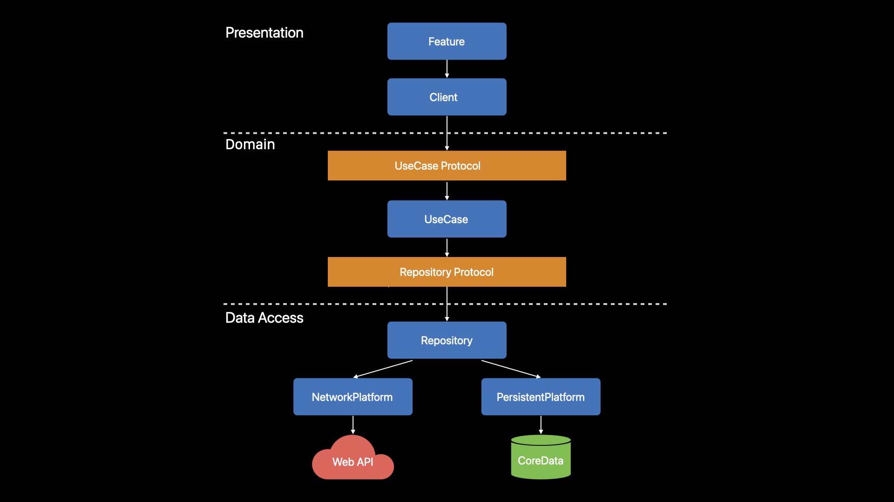
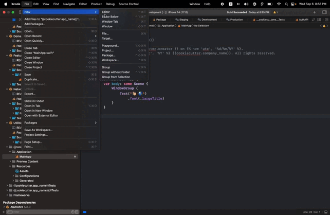

## iOS Project Boilerplate for SwiftUI
[](https://developer.apple.com/xcode/)
[](https://swift.org)
[](https://developer.apple.com/ios/)
[](https://github.com/rokon-uddin/swiftui-tca-boilerplate/actions/workflows/build.yml)


A boilerplate to jumpstart your next app for Apple platforn using SwiftUI and TCA with integrating best practices and tools.

## Motivation

Accelerate your iOS/macOS development by eliminating repetitive setup tasks and establishing a solid, best-practice-driven foundation. This boilerplate empowers you to focus on building features, not reinventing the wheel.


## Best practices
* [Composable Architecture](https://github.com/pointfreeco/swift-composable-architecture): Robust, scalable state management with SwiftUI friendly patterns.
* [R.swift](https://github.com/mac-cain13/R.swift): Get strong typed, autocompleted resources like images, fonts and segues in Swift projects.
* [Standard gitignore](https://github.com/github/gitignore/blob/master/Swift.gitignore): Keep your repository clean and focused.
* [Moya](https://github.com/Moya/Moya): Streamlined networking layer with clear abstraction.
* [Swift-Format](https://github.com/apple/swift-format): Enforce consistent code style for maintainability.
* **App Flavors:** (Development, Staging, Production): Separate configurations for different environments.
* **Build Configuration per Flavor:** Fine-grained control over build settings.

## Architecture overview
The boilerplate is structured using a Clean Architecture to promote modularity, maintainability, and testability.



### Presentation Layer
* **Purpose:** This layer is responsible for rendering the user interface (UI) and handling user interactions. It uses SwiftUI to build views and the Composable Architecture (TCA) for state management.

* **Responsibilities:**
	* UI Rendering: Displays the product title, description, and interactive buttons.
	* User Input: Captures button taps and other user interactions.
	* State Management (TCA): Manages the application state.
	* Navigation: Handles transitions between screens (e.g., showing a sheet or full-screen cover).
	
### Domain Layer
* **Purpose:** This layer contains the core business logic and models of the application. It defines how data is structured. Additionally, it defines repository protocols to create an abstraction for data access.

* **Responsibilities:**
	* Business Logic: Implements the rules and operations that define the core functionality of the app.
	* Data Modeling: Defines the structure of the Product data and other entities relevant to the domain.
	* Use Cases: Defines abstract interactions with the domain (e.g., ProductUseCase for fetching a product).
	* Repository Protocols: Defines interfaces for interacting with data sources. These protocols act as contracts, specifying the operations (e.g., read, create, update) that the data access layer must implement. This separation of concerns keeps the domain layer clean and independent of specific data access technologies.

### Data Access Layer
* **Purpose:** This layer handles the communication with external data sources, such as remote APIs or local databases. It implements the repository protocols defined in the domain layer.

* **Responsibilities:**
	* Data Retrieval: Fetches product data from a remote API.
	* Data Persistence: (If applicable) Saves, updates or deletes persistent data in a local database.
	* Networking: Manages network requests, error handling, and authentication.
	* Data Mapping: Translates data between the format used by the data source and the domain models.
	* Repository Implementations: Provides concrete implementations of the repository protocols, defining how data is actually retrieved or stored.
	
###Additional Features (ToDo in the boilerplate)

* Deeplink handling base classes
* Notification handling base classes
* Integration with analytics and crash reporting tools

### Supporting Tools
Xcode 14.0 or later and Swift 5.5 or later.

### Prerequisites
* Xcode 14.0 or later
* Swift 5.5 or later
* [Cookiecutter](https://cookiecutter.readthedocs.io/en/latest/installation.html)

Install cookiecutter by runing below terminal command.

```
brew install cookiecutter
```

## Usage
The boilerplate uses Cookiecutter to create your project from it.

1.  Run the below command to create your project:

	```
	cookiecutter https://github.com/rokon-uddin/swiftui-tca-boilerplate.git
	```
2. Follow the prompts for app name and company name.
3. Update bundle IDs for main and test targets.

## Build configurations
Boilerplate uses `.xcconfig` and `BuildConfiguration.plist` for managing environment-specific settings. Refer to the linked guide for detailed instructions.
[link](https://medium.com/better-programming/how-to-create-development-staging-and-production-configs-in-xcode-ec58b2cc1df4).


## TCA XCTemplate installation (optional)
All the Xcode custom template files are located in ~/Library/Developer/Xcode/Templates/ and grouped into sections by folder name. 

1. Create a folder with name `Custom Templates` manually or by running the following command from the terminal:

	```
	mkdir ~/Library/Developer/Xcode/Templates/Custom Templates
	```

2. Drag and drop the `TCA.xctemplate` file(included with the repo to the `Custom Templates` directory). 
3. The TCA template now will be available in Xcode's File Templates.



## Contributing guidelines
Please see [Contributing Guidelines](https://github.com/rokon-uddin/swiftui-tca-boilerplate/blob/main/CONTRIBUTING.md) before participating.


## Acknowledgments

* [iOS Project Best Practices and Tools](https://medium.com/@piotr.gorzelany/ios-project-best-practices-and-tools-c46135b8116d)
* [Development, Staging and Production Configs in Xcode](https://medium.com/better-programming/how-to-create-development-staging-and-production-configs-in-xcode-ec58b2cc1df4)
* [iOS Build Management using Custom Build Scheme](https://www.talentica.com/blogs/ios-build-management-using-custom-build-scheme/)

## 👥 Credits
This boilerplate project is a collaborative effort, made with ❤️ by:

* [Arman Morshed](https://github.com/Arman-Morshed)
* [Mohammed Rokon Uddin](https://github.com/rokon-uddin)
